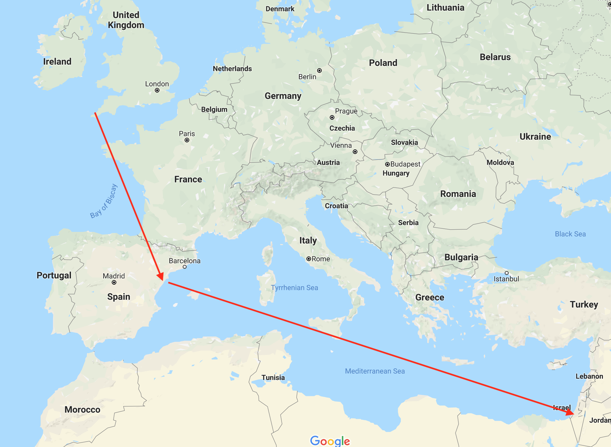

Two years ago, I spent my winter break living in Kibbutz Neot Semedar, a [kibbutz](https://en.wikipedia.org/wiki/Kibbutz) in the Negev of Israel. One day I was tasked to design the electrical circuits with Dan, an Israel-Argentinian 22 year engineer who recently finished his military service. In that day, something clicked. I took Spanish courses years ago, but treated it as a class rather than a language and never understood a thing. Dan had started teaching me Spanish from the perspective of a Hebrew speaker. In that one day, I learned more Spanish than I did in 4 years of courses, and developed a theory on language. These last two months I've been living/traveling in Argentina, and successfully tested this theory.

This post is not about "why" to learn another language, but rather my "how".

To preface, there are of course different levels of fluency. As it turns out, every Spanish speaking country has their own dialect. I speak Argentinian Spanish, due to my travels in Argentina and enamoration with Argentinian culture. I still have a ton to learn, and sometimes words just don't come out for me. Regardless, to provide perspective on where my level of fluency is:
- Most who come from outside of Latin America tend to perceive me as a local.
- Argentinians tend to think I'm European, usually someone from France/Brazil who learned Spanish with ease, or someone from another part of Europe who has Argentinian parents. I've met several English teachers in Argentina, who all found it easier to communicate with me in Spanish than in English.
- The other day, I met two Chileans and hung out with them for a while. An hour in to our encounter, an Australian came and asked us a few questions in English. I answered, and was then complimented by two Chileans on how well I speak English, as they were convinced I was from Buenos Aires.

Obviously, there's room where I can grow. Nonetheless, I think and speak in Spanish effortlessly, and the method to do so is what I hope to distill in this post.

## For everyone

Try to remember when you first learned your first language. Do you find it hard to remember exactly how you initially learned? Very well. Try to remember how you learned in grade school. Perhaps the first time you learned that "will not" isn't abbreviated as "willn't" but rather as "won't"? Or even in middle school, where you learned to use more advanced words, craft paragraphs, and the like.

Now, in these cases in your youth, do you ever remember consciously translating into another language or symbols of sort? Of course not. What you learned was just building off  what you knew before, which you learned subconsciously by being listening and seeing. For verb conjugation, I'd be willing to guess you subconsciously learned the pattern and didn't think to yourself "oh, I'm talking in the past tense and hence will now use the impreterite".

Or even currently, if you encounter an unfamiliar word, do you translate it? I'd be willing to guess you either learn by carefully reading into its context or by using a dictionary.

When I met Dan, the Israeli-Argentinian backpacker, I realized I always sought to translate Spanish to English. It took someone translating Spanish into Hebrew to realize how wrong this is. Spanish isn't English, nor is it Hebrew. Spanish is Spanish. Whatever language you want to learn is its proper self, not the language you already know. And as such, when you start to translate is when things start to go wrong.

This is a key point. **You should avoid translating at all costs**. Instead, seek to build complexity off of what you already know - in this fashion you will both learn new things and reinforce what you already know most naturally. You should seek to find yourself thinking unconsciously in your target language.

Assuming you're reading this, you likely speak English at a very high level. Congratulate yourself! English is one of the most spoken and most useful languages in the world. Furthermore, you also speak a language of Anglo-Saxon and Latin roots, which makes it particularly easy to learn European languages. This is a huge advantage - you didn't have this as a baby! For instance, you can instantly know that "resentimiento" in Spanish means resentment, without needing to go through the years of grade school Spanish education. This is your advantage to learning even faster.

You had a few advantages as a baby.
Not thinking at all, silence the mind.
Plasticity of the mind.
Time and patience.
Necessity and desire to communicate.

- Build a base as fast as possible. This can be done fairly well with children's movies, Duolingo, classes, c
- Afterwards, don't translate.
- Be super interested in the cutlure. This can't be overstated. Have a necessity to speak.
- On this note, listen to music in the language. You'll get the accent better, etc. Spanish has a ton of different music, from cumbia to reggaeton to bachata to salsa.

## Additions for bilingual speakers

I grew up in a Hebrew speaking household in the US. As such, I've spoken both languages fluently since I was young. You may have something similar if you're reading this section - perhaps one parent is from a different country, perhaps you took French courses since your youth, etc.

What you don't know is that as a result, you have an increased facility for language learning.

When I first started learning Spanish,

There's perhaps

ya = כבר
In English, the concept of "ya" is a bit complicated to explain. Take these three sentences as an example:
- Ya fui al supermercado - I already went to the supermarket.
- [Ya no sé que hacer conmigo]() - I don't know what to do with myself anymore. (This is also the name great song by Uruguayan band Cuarteto de nos)
- Ya vuelvo - I return soon.

Translating these directly into English causes immediate problems. In the first sentence, "ya" means "already"; in the second, "ya" means "anymore"; in the third, "ya" means "soon". In Hebrew, on the contrary, "ya" is exactly the word "כבר" in these common contexts.

## What I did

- Watch Naruto in Spanish
- Language exchange with Lawrence
- Listen to a lot of music in Spanish
- Try to talk to everyone in Argentina (works best in non-touristy areas)
