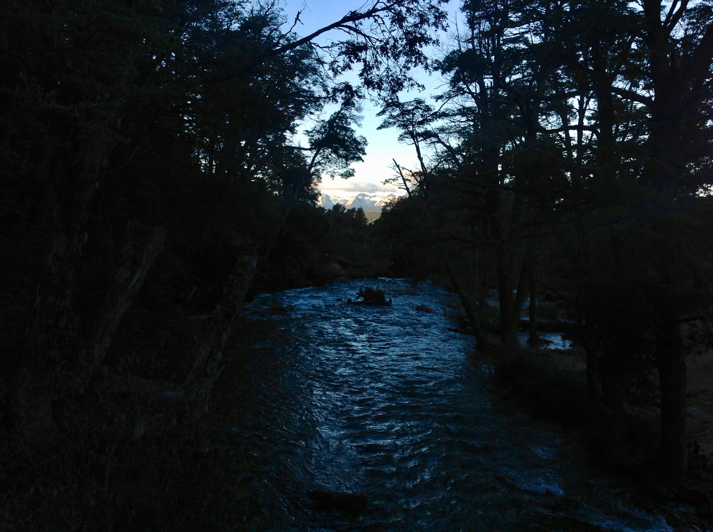
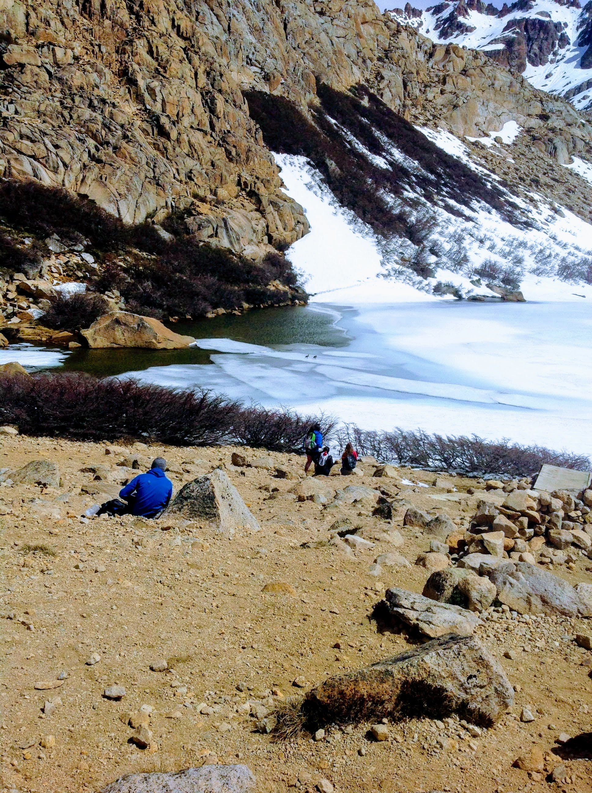

## What I’m doing now

I'm traveling and working on a few projects. A few days ago I left the city of Buenos Aires, and am now currently in the beautiful city of San Carlos de Bariloche in the Patagonia region in Argentina. My first time seeing the Patagonia in the daylight I almost cried - this is the most beautiful landscape I have ever seen. Here are two photos to show what I mean. You walk around and everything looks like this:

<!-- 

 -->

It's hard to believe I arrived to this country over a month and a half ago. When I arrived, I knew almost no one, barely spoke the language, and only knew small bits about the culture. Since then, everything has changed. I've made a ton of new friends, who by now say I'm completely "porteño". I learned to speak the language with complete fluency, to the point where I was recently complimented by two Chileans who after an hour of chatting were convinced I was from Buenos Aires. Learning to speak a new language well in itself has been an incredibly humbling experience, as basically anyone I'd normally interact with was instantly "smarter" as soon as words came out. I've really experienced the culture by now - how open and spontaneous Argentinians can be, how to spend hours at an asado, how to be extremely egotistical and simultaneously self-deprecating, how to complain about what a quilombo (mess) Buenos Aires is with its lleno de gente subte (crowded metro) and lack of green area in the city, just to name a few things. I also did a 10-day Vipassana meditation retreat in the province of Buenos Aires which was an enlightening experience - hopefully I'll have time to write about this as well :).

Of course, not every moment has been pleasant or fun. Like any nation, Argentina is plagued by it's own special issues. One of these is the import taxes on technology, which leads to an enormous number of phone robberies. Each one of my friends in Buenos Aires has been robbed of their phone at least once. In my last day in Buenos Aires, the same finally happened to me. This has In a way this is quite liberating, as I unfortunately adopted the habit that many have here of being on WhatsApp all the time. But the unpleasant moments, like the pleasant ones, also pass. Being here for enough time, I've realized I don't need to be tied down to the place or culture of San Francisco or Tel Aviv. Nor in that matter Buenos Aires or anywhere else in Argentina. This unfamiliar land has become familiar, and given a new "identity". Most importantly, another identity to remind me how really this idea of identity is just a demonstration of the ego; how really I am nothing more than here and now; how little us as humans know about our universe, our world, and ourselves.

The general direction of my travels is northwest; one might call this "the long way" back to San Francisco, California. I'm especially looking to meet introspective, curious, and kind people on my journey. If you know or are one of these, reach out at ronnyb - at - jhu - dot - edu.

*This update was written Nov 20th, 2017.*
